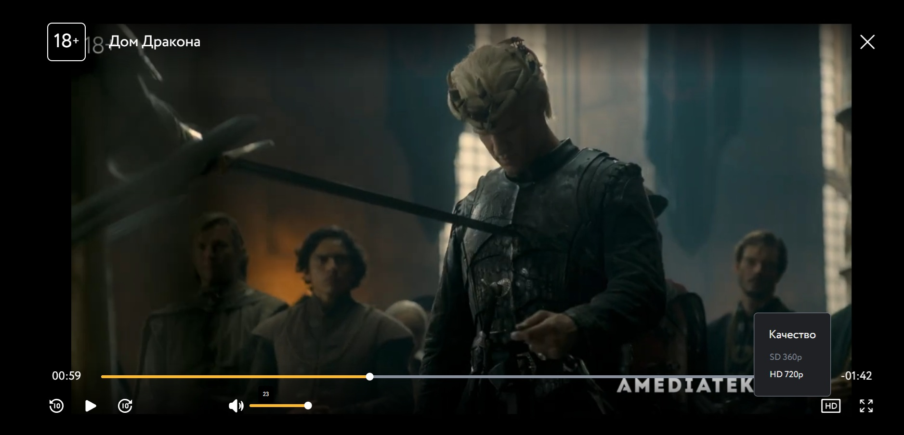
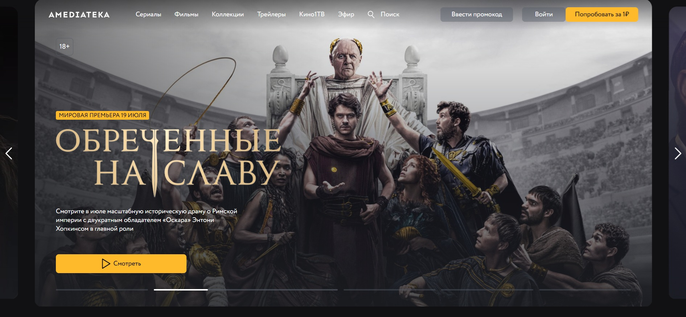
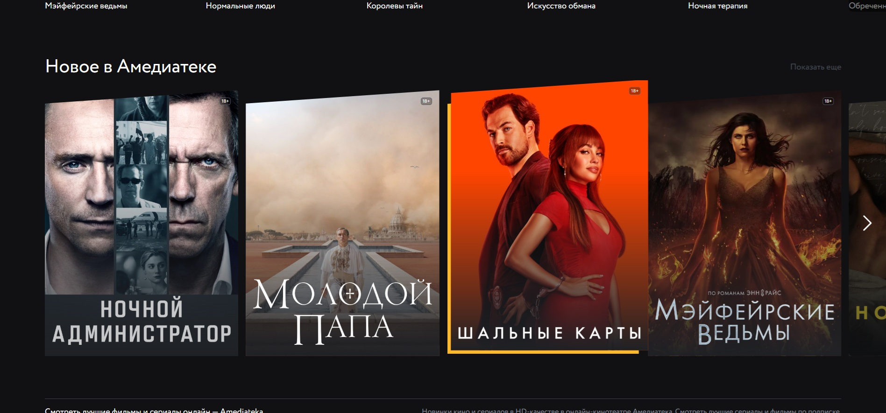
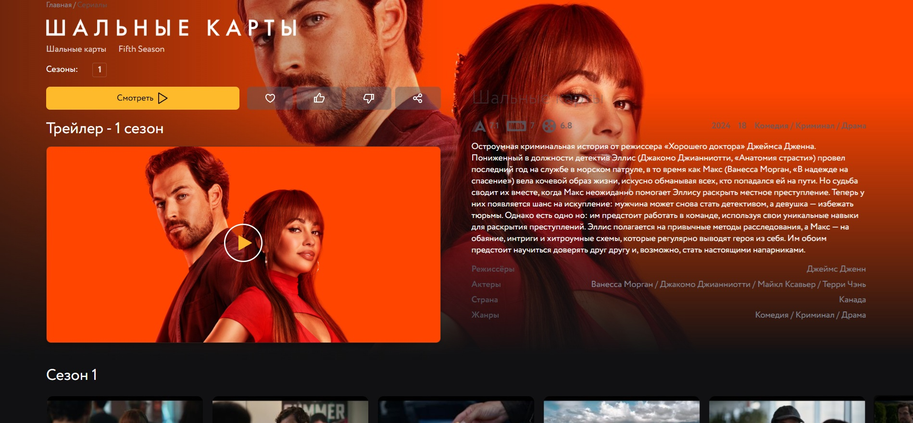
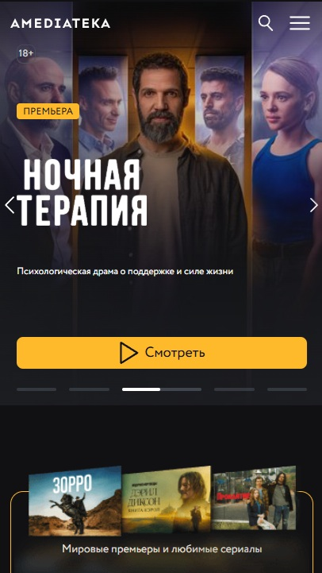
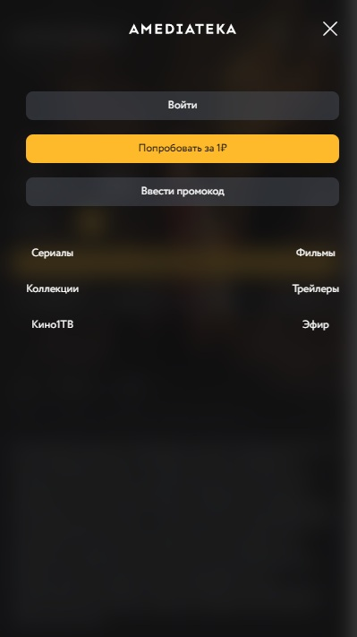
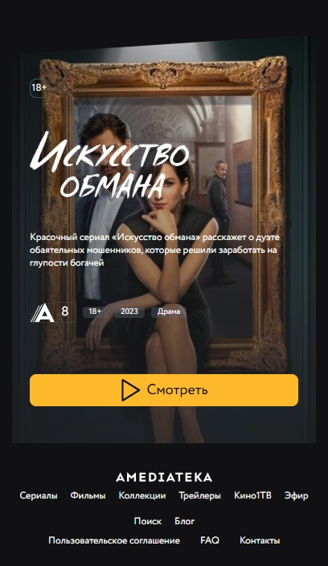

# 🎥 Amediateka Clone | Pet Project by Denis Kazlou

Привет! 👋 Меня зовут Денис Козлов, и это мой учебный проект — клон видеосервиса [Amediateka](https://www.amediateka.ru/), созданный для отработки современных технологий фронтенд-разработки.

**Что это?**
Frontend-приложение с элементами FullStack:

✨ **Сильные стороны**:
- React-интерфейс на Vite + TypeScript
- Гибкое управление состоянием через Redux Toolkit
- Хорошее TypeScript-покрытие (типизировано >80% кода)
- Современная стилизация с использованием SCSS модулей
- Клиентская логика с обработкой ошибок API
- BEM

⚒️ **Учебные элементы**:
- REST API (Node.js + Express + MongoDB)
- Практика работы с JWT-аутентификацией
- Опыт проектирования API endpoints
- Требует доработки архитектуры и безопасности


📊 **Метрики проекта** (по данным cloc):

| Language   | files | blank  | comment | code    |
| ---------- | ----- | ------ | ------- | ------- |
| TypeScript | 1896  | 30,389 | 178,867 | 219,129 |
| SCSS       | 48    | 731    | 0       | 3,377   |

🔒 **Этика контента**:
- Все видео — публичные трейлеры с официальных YouTube-каналов
- Используются только открытые данные о фильмах/сериалах
- Нет пиратского или платного контента

## 📌 **Особенности реализации**

🎨 **Стилизация**:
- Desktop-first подход в адаптивном дизайне
- SCSS-модули с компонентной организацией
- Строгое следование BEM (`Блок__Элемент--Модификатор`)
- Миксины для повторяющихся паттернов
- Переменные для единой дизайн-системы

🚀 **Работа с состоянием и API**:
- Управление состоянием через Redux Toolkit (слайсы + `createAsyncThunk`)
- Отправка запросов через `axios` с четкой типизацией
- Разделение на feature-слайсы (content, auth, user)
- Полная типизация хранилища Redux

⚛️ **Архитектура компонентов**:
- Типизированные пропсы с `interface` и `type`
- Кастомные хуки
- "Глупые" компоненты для отображения

🔌 **Интеграция с бэкендом**:
- Контент загружается динамически, сервер отдает актуальные данные по запросу
- API использует *JWT* для управления авторизацией пользователей.
- Обработка ошибок API в едином формате
- Валидация данных перед отправкой на клиенте (проверка форм, e-mail, паролей)

## 🛠 **Стэк технологий**

### 🚀 **Client (Frontend)**
- **React** `19.1.0` – UI библиотека
- **Redux Toolkit** `2.6.1` – управление состоянием
- **React Router DOM** `7.4.1` – маршрутизация
- **Axios** `1.8.4` – работа с API
- **SCSS** – модульная стилизация
- **Vite** – сборка проекта

### 🏗 **Server (Backend)**
- **Express** `5.1.0` – серверный фреймворк
- **MongoDB / Mongoose** `6.16.0` – работа с базой данных
- **JWT (jsonwebtoken)** `9.0.2` – аутентификация
- **Multer** `1.4.5-lts.2` – загрузка файлов
- **bcrypt** `5.1.1` – хеширование паролей
- **Cookie-parser** `1.4.7` – работа с куками

## ✅ **Реализованные функции**

🔐 **Авторизация**:
- JWT-аутентификация с двойными токенами
  - Access Token в Redux Store
  - Refresh Token в HttpOnly cookies
- Приватные/публичные маршруты
- Валидация форм (логин/регистрация)

🎬 **Видеоплатформа**:
- Кастомный видеоплеер с управлением
- Адаптивный слайдер для контента
- Детальные страницы фильмов/сериалов
  - Описание, рейтинг, актёры


📡 **Работа с данными**:
- REST API на Express
- Хранение данных в MongoDB

🎨 **Интерфейс**:
- Адаптивный дизайн
- BEM-методология в SCSS
- Лоадеры для состояний загрузки
- Обработка ошибок API

## 🖼 **Скриншоты интерфейса**

### 🎬 Кастомный видеоплеер

*Ключевые особенности:*
- Плавное управление громкостью/прогрессом
- Кнопки полноэкранного режима
- Адаптивный размер под контейнер
- Заголовок видео в overlay

### 🎪 Главная страница



- Сетка контента с hover-эффектами
- Категории с горизонтальным скроллом
- Адаптация под мобильные устройства

### 🎞 Страница фильма

- Лайтбокс с трейлером
- Описание и метаданные
- Серии сезонов

### 📱 Мобильная версия (Главная страница)




*Особенности:*
- Адаптивное меню-бургер
- Вертикальная лента контента
- Оптимизированные карточки фильмов

## 🚧 **Планируемые улучшения**

🔍 **Поиск и фильтрация**:
- Full-text поиск по каталогу
- Фильтры по жанрам/годам
- Сортировка по рейтингу/дате

⚡ **Оптимизации**:
- ✅ Lazy Loading компонентов [(New Release)](https://github.com/dmathcore231/petAmediateka/commit/3d6e78c0b1d792fcedb0f878be8ab397864d09f7) - реализована при помощи IntersectionObserver
- Виртуализация списков

📺 **Видеотехнологии**:
- HLS-стриминг для видео
- Адаптивный битрейт
- Буферизация и предзагрузка

🧩 **Дополнительно**:
- Система рецензий/комментариев
- "Смотреть позже" (watchlist)
- История просмотров

## 🔍 На что обратить внимание?

Поскольку файлов много, вот ключевые части проекта, которые стоит изучить:

#### **🚀 Ядро приложения**
🔹 [`/client/src/main.tsx`](./client/src/main.tsx) - *Точка входа*

🔹 [`/client/src/components/App/index.tsx`](./client/src/components/App/index.tsx) - *Корневой компонент*

🔹 [`/client/src/utils/router.tsx`](./client/src/utils/router.tsx) - *Маршрутизация*

🔹 [`/client/src/redux`](./client/src/redux/) - *Redux (store/slices)*

🔹 [`/client/src/services`](./client/src/services/) - *API endpoints и createAsyncThunk*

#### **🧩 Компоненты**
🔹 [`/client/src/components/Btn/index.tsx`](./client/src/components/Btn/index.tsx) - *Кнопки*

🔹 [`/client/src/components/Card/index.tsx`](./client/src/components/Card/index.tsx) - *Карточки контента*

🔹 [`/client/src/components/MediaPlayer/index.tsx`](./client/src/components/MediaPlayer/index.tsx) - *Медиаплеер*

🔹 [`/client/src/components/Slider/index.tsx`](./client/src/components/Slider/index.tsx) - *Слайдер*

#### **🎨 Стили (SCSS)**
🔹 [`/client/src/styles/app.scss`](./client/src/styles/app.scss) - *Глобальные стили*

🔹 [`/client/src/styles/_variables.scss`](./client/src/styles/_variables.scss) - *CSS-переменные*

🔹 [`/client/src/styles/_mixins.scss`](./client/src/styles/_mixins.scss) - *SCSS-миксины*

## 📂 Структура проекта
Основные файлы и папки находятся в `src`.
```plaintext
src/
 ├── assets/          # Шрифты и SVG иконки в виде JSX.Element .
 ├── components/      # Все переиспользуемые React-компоненты.
 ├── helpers/         # Начальные состояния для Slice и компонентов,функции помощники.
 ├── hooks/           # Кастомные hooks
 ├── pages/           # Страницы
 ├── redux/           # Redux Store/Slices/Middleware
 ├── redux/           # Redux Store/Slices/Middleware
 ├── services/        # EndPoints запросы к серверу и createAsyncThunk
 ├── services/        # EndPoints запросы к серверу и createAsyncThunk
 ├── styles/          # Глобальные стили/миксины/анимации
 ├── types/           # types/interfaces
 ├── utils/           # Router react-router-dom и конфиг Axios
 ```
